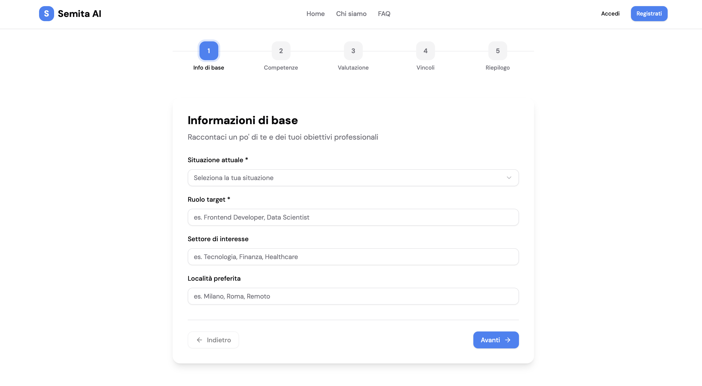
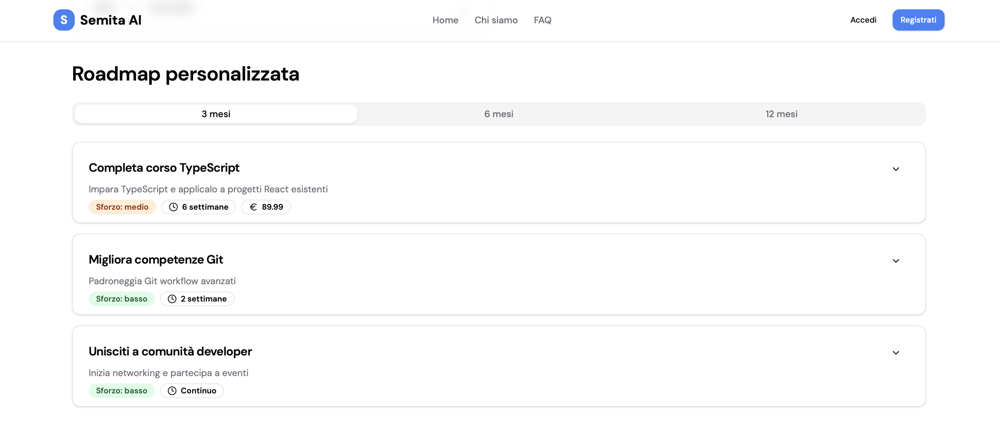
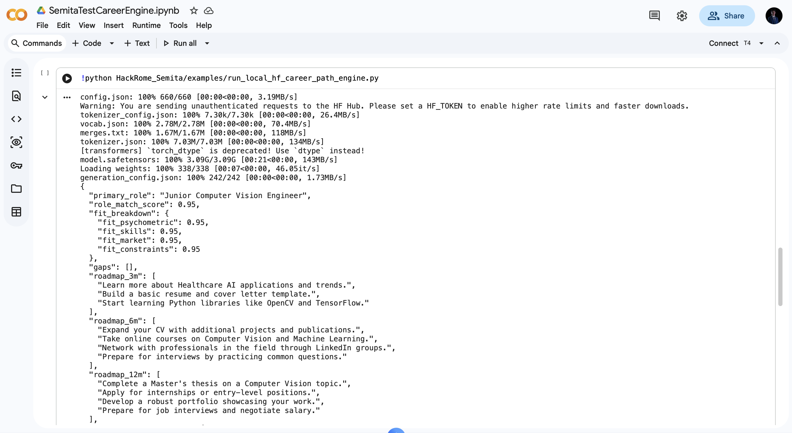

<p align="center">
  
</p>

<h1 align="center">SemitaAI CareerPathEngine</h1>

<p align="center">
  <strong>Local, structured career-path generation powered by ESCO skills data and open-source Hugging Face models.</strong>
</p>

<p align="center">
  <a href="https://colab.research.google.com/drive/1t9a4gy8UPhOLFM9CoRpOT12dxsjsVoUo?usp=sharing">
    
  </a>
  <a href="https://github.com/Martons00/HackRome_Semita">
    
  </a>
  <a href="https://sienna-duck-439116.hostingersite.com">
    
  </a>
  
  
  
</p>

## Overview

SemitaAI CareerPathEngine generates realistic, data-driven career paths from a validated user profile. It combines:

- structured user data: CV, skills, constraints, interests, and psychometric profile;
- ESCO REST API retrieval for role definitions and related skills;
- a local/open-source Hugging Face model;
- Pydantic validation for a clean `CareerPathOutput` JSON object.

The engine is designed to return actionable roadmaps, not generic advice or mass-application spam.

## Demo

Use the Colab notebook as the fastest way to test the project.

<p>
  <a href="https://colab.research.google.com/drive/1t9a4gy8UPhOLFM9CoRpOT12dxsjsVoUo?usp=sharing">
    
  </a>
  <a href="https://sienna-duck-439116.hostingersite.com">
    
  </a>
</p>

You can also upload `SemitaTestCareerEngine.ipynb` manually to Google Colab, or try the hosted WebApp:

[Open the live WebApp](https://sienna-duck-439116.hostingersite.com)

<table>
  <tr>
    <td align="center">
      <br>
      <strong>Colab demo</strong>
    </td>
    <td align="center">
      <br>
      <strong>GitHub repository</strong>
    </td>
    <td align="center">
      <a href="https://sienna-duck-439116.hostingersite.com">
        
      </a><br>
      <strong>Website demo</strong>
    </td>
  </tr>
</table>

## Screenshots

### User Profile Form



### Generated Career Path



### Google Colab Demo



## Local Setup on Mac M1 16GB

Install dependencies:

```bash
pip install -r requirements.txt
```

If you are working from Colab or from a directory outside the repository root, install the package in editable mode:

```bash
pip install -e .
```

The default model is `Qwen/Qwen2.5-1.5B-Instruct`, small enough to run locally on a Mac M1 with 16GB RAM through PyTorch/MPS.

## Quick Start

```bash
python examples/run_local_hf_career_path_engine.py
```

The example uses the ESCO REST API to retrieve occupations and skills related to the target role, then passes that context to the local Hugging Face model.

To try a stronger but slower model:

```bash
HF_MODEL_ID="Qwen/Qwen2.5-3B-Instruct" python examples/run_local_hf_career_path_engine.py
```

To change the ESCO response language:

```bash
ESCO_LANGUAGE=it python examples/run_local_hf_career_path_engine.py
```

## Output Schema

The engine always returns a validated `CareerPathOutput` object ready for a UI or downstream pipeline:

```json
{
  "primary_role": "Junior Medical Imaging Computer Vision Engineer",
  "role_match_score": 0.86,
  "fit_breakdown": {
    "fit_psychometric": 0.92,
    "fit_skills": 0.78,
    "fit_market": 0.82,
    "fit_constraints": 0.88
  },
  "gaps": [],
  "roadmap_3m": [],
  "roadmap_6m": [],
  "roadmap_12m": [],
  "recommended_resources": [],
  "interview_prep_topics": []
}
```

If the model output is not valid JSON, the engine fails explicitly instead of returning incomplete data.

## Project Structure

```text
career_path_engine/
  schemas.py       Pydantic models for input and output
  prompts.py       CareerPathEngine system instructions
  esco.py          ESCO REST API client and role/skill retriever
  local_hf.py      Local Hugging Face engine with JSON validation
  chain.py         Optional LangChain-compatible chain factory
examples/
  run_local_hf_career_path_engine.py
img/
  header.jpeg
  FormScreenShot.png
  PathScreenshot.png
  ColabScreenShot.png
  *_QR_Code.png
```

## ESCO REST API

The ESCO retriever calls:

- `/search` with `type=occupation` to derive similar roles from the target role;
- `/search` with `type=skill` to retrieve related skills;
- `/resource/occupation?uri=...` to fetch occupation details;
- `/resource/skill?uri=...` to fetch skill details.

This context is injected into the model prompt so the roadmap is grounded in occupational and skills data.

## Practical Notes

On the first run, Hugging Face downloads the selected model. After that, the model remains in the local cache.

For Colab demos, GPU runtime is recommended when available. CPU runtime works for small models, but generation will be slower.
